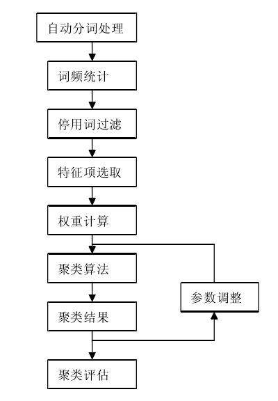

### 文本挖掘的目的

**文本挖掘**（Text mining）有时也被称为[文字探勘](https://zh.wikipedia.org/wiki/文字探勘)、文本[数据挖掘](https://zh.wikipedia.org/wiki/数据挖掘)等，大致相当于[文字分析](https://zh.wikipedia.org/wiki/文字分析)，一般指文本处理过程中产生高质量的[信息](https://zh.wikipedia.org/wiki/信息)。高质量的信息通常通过分类和预测来产生，如[模式识别](https://zh.wikipedia.org/wiki/模式识别)。文本挖掘通常涉及输入文本的处理过程（通常进行分析，同时加上一些派生语言特征以及消除杂音，随后插入到[数据库](https://zh.wikipedia.org/wiki/数据库)中） ，产生[结构化数据](https://zh.wikipedia.org/wiki/结构化数据)，并最终评价和解释输出。'高质量'的文本挖掘通常是指某种组合的[相关性](https://zh.wikipedia.org/wiki/相关性)，新颖性和趣味性。典型的文本挖掘方法包括[文本分类](https://zh.wikipedia.org/w/index.php?title=文本分类&action=edit&redlink=1)，[文本聚类](https://zh.wikipedia.org/w/index.php?title=文本聚类&action=edit&redlink=1)，[概念/实体挖掘](https://zh.wikipedia.org/w/index.php?title=概念挖掘&action=edit&redlink=1)，生产精确分类，[观点分析\情感分析](https://zh.wikipedia.org/w/index.php?title=观点分析&action=edit&redlink=1)，[文档摘要](https://zh.wikipedia.org/w/index.php?title=文档摘要&action=edit&redlink=1)和[实体关系模型](https://zh.wikipedia.org/wiki/實體關係模型)（即，学习[已命名实体](https://zh.wikipedia.org/w/index.php?title=已命名实体&action=edit&redlink=1)之间的关系） 。 文本分析包括了信息检索、词典分析来研究词语的频数分布、模式识别、标签\注释、信息抽取，数据挖掘技术包括链接和关联分析、可视化和预测分析。本质上，首要的任务是，通过自然语言处理（NLP）和分析方法，将文本转化为数据进行分析。

### 文本挖掘主要的数据处理步骤

主要的数据处理步骤如下：

1. 文本数据的获取
2. 文本数据的预处理
3. 文本数据挖掘

如下图所示：


### 具体以文本聚类来看，主要的流程如下：


其中，以分词技术为例谈我的观点：分词技术到目前为止，中文分词技术仍存在**三大难题**未完全突破：1.分词的规范：字和词的界限往往很模糊，并没有一个公认、权威的标准，会有很多不同主观上的分词差异2.歧义词的切分，歧义词的情况分为：**交集型歧义**、**组合型歧义**和**混合型歧义。**另外，更头痛的情况就是**真歧义**，即使是人都无法判断的情况3.未登录词识别，就是**新词**的意思，如**人名、地名、网络用词**等等。

聚类算法有许多中，如K-means均值聚类， **DBSCAN算法**,**OPTICS算法**等。利用不同的算法得出的聚类结果可能结果有一定的差异，同时，聚类的数目也会影响聚类结果。

### （2）文本聚类的现实案例

下面将采用R语言来对[人民网](http://search.people.cn/s?keyword=房地产&st=3&_=1641729445490)中含有房地产的报刊进行情感分析。

#### 加载相关包

```R
library(RSelenium)
library(stringr)
library(rvest)
```

#### 模拟浏览器行为

外部通过 `java -jar selenium-server-standalone-4.0.0-alpha-2.jar`启动Selenium后启动 `firefox`。

##### 打开浏览器并进入网站

此次要爬取的文章为人民日报中关于房地产的文章，进入网站。

```{r}
remDr <-  remoteDriver("localhost",4444L,browserName = "firefox")
remDr$open()
remDr$navigate("http://search.people.cn/s?keyword=%E6%88%BF%E5%9C%B0%E4%BA%A7%C2%B7&st=3&_=1641644927846")
```

##### 在网页里利用 `xpath`选择器选择文章链接

进入网站时会发现每页只有10篇文章，所以每次提取10篇文章的信息，当然这里使用 `xpath`定位元素。而总共有8页，此时使用 `css selector`选择下一页。

```{r}
links <- c()
titles <- c()
for (j in 1:8) {
for (i in 1:10) {
xp=paste0("/html/body/div/div/div/div/div[2]/div[2]/div[1]/div/ul/","li[",i,"]/div/div[1]/a")
webElm <- remDr$findElement(using="xpath",xp)
links <- c(links,as.character(webElm$getElementAttribute("href")))
titles <- c(titles,as.character(webElm$getElementText()))
}
if (j<8) {
webElm <- remDr$findElement(using="css selector",'.page-next')
webElm$clickElement()
Sys.sleep(2)
}

}
library(dplyr)
df <- cbind(titles,links)
df <- as.data.frame(df)
df <- df %>% distinct(titles, .keep_all = TRUE)
detach("package:dplyr", unload = TRUE)
```

##### 获取所有链接中的文章的文本数据

```{r}
articles <- c()#将所有文章保存在里面
for (i in 1:length(links)) {
 remDr$navigate(links[i])
 Sys.sleep(2)
 #下面这行代码通过获取网页上复制全文对应的元素
 webElm <- remDr$findElement(using="xpath",'/html/body/div[2]/div[2]/div[3]/div[1]/a[3]/span')
 webElm$clickElement()#点击复制文章
 article <- readClipboard()#获取剪切板上的数据
 temp <- ""#中间变量，用于合并剪切板读取的多行向量
 for (i in 1:length(article)) {
    temp <- str_c(temp,article[i])   
 }
 articles <- c(articles,temp)
}
```

文章标题及链接已经放在[附录](#jump)

## 文本预处理

### 加载文本挖掘所需的包

```{r}
library(tm)
library(tmcn)
library(NLP)
```

### 下面进行数据清洗和分词

```{r}
library(Rwordseg)
names(wdf) <- c('doc_id','text')
articles <- str_remove_all(articles,'[0-9]')
articles <- str_remove_all(articles,'[a-z]')
articles <- str_remove_all(articles,'&nbsp')
seg_result <- segmentCN(articles)
#自定义删除停止词的函数
stopword <- readLines(jiebaR::STOPPATH,encoding = 'UTF-8')
removewords <- function(target_words,stop_words){target_words = target_words[target_words%in%stop_words==FALSE];return(target_words)}
seg_result <- sapply(X = seg_result, FUN = removewords,stopword)
seg_result <- sapply(X = seg_result,FUN=removewords,c('年','月','元','新','亿','万','记者','公告','表示','日','中',))
```

### 建立语料库并对语料库进行处理

```{r
#创建语料库
text_corpus <- VCorpus(VectorSource(seg_result))
#创建文档-词条矩阵
dtm <- createDTM(text_corpus)
#标题作为矩阵的行名
rownames(dtm) <- wdf$doc_id
```

查看矩阵样例

```{r
inspect(dtm)
```


可以看到矩阵的稀疏度达到了96%,同时也包含了太多的词。下面剔除一些出现频次极低的词语。

```{r}
dtm <- removeSparseTerms(dtm,sparse = 0.7)
inspect(dtm)
```


### 作出词频统计柱状图

下面作出出现频率最高的十个词语的柱状图

```{r}
freq <- sort(colSums(as.matrix(dtm)), decreasing = TRUE)
wf <- data.frame(word = names(freq), freq = freq)
wf <- wf[1:10, ]
barplot(wf$freq, names = wf$word, main = "Word Frequency",
xlab = "Words", ylab = "Counts", ylim = c(0, 550))
```


当然词云图也是很好画的

```{r}
word_freq <- createWordFreq(unlist(seg_result))
wordcloud2::wordcloud2(word_freq,minSize = 50)
```


### 统计建模：聚类分析

下面选取一个样本的子集进行聚类，合10篇文章

```{r}
#将矩阵转换为数据框格式
rownames(dtm) <- as.character(1:75)
df <- as.data.frame(inspect(dtm))
#计算距离

d <- dist(df)

#层次聚类法之McQuitty相似分析法

fit1 <- hclust(d = d, method = 'mcquitty')

plot(fit1)

rect.hclust(tree = fit1, k = 3, border = 'red')
```


可以看到，第64篇文章单独一类，第38篇文章与第55篇文章成一类，其他成一类。文章的id在[附录](#jump)已经给出。

## `<span id='jump'>`附录

文章标题和链接：

|    | 标题                                                                   | 链接                                                                               |
| -- | ---------------------------------------------------------------------- | ---------------------------------------------------------------------------------- |
| 1  | 房地产信托谋出路                                                       | http://paper.people.com.cn/gjjrb/html/2021-07/19/content_3058643.htm               |
| 2  | 促进房地产市场平稳健康发展（政策解读）                                 | http://paper.people.com.cn/rmrb/html/2021-07/23/nw.D110000renmrb_20210723_1-12.htm |
| 3  | 持续开展整治规范房地产市场秩序                                         | http://paper.people.com.cn/rmrbhwb/html/2021-07/26/content_3059822.htm             |
| 4  | 严防经营贷违规流入房地产                                               | http://paper.people.com.cn/rmrb/html/2021-03/30/nw.D110000renmrb_20210330_4-13.htm |
| 5  | 从实际出发加快发展保障性租赁住房坚定不移全面落实房地产长效机制         | http://paper.people.com.cn/rmrbhwb/html/2021-07/23/content_3059472.htm             |
| 6  | 房地产发展，落脚点是民生（迈入“十四五”·聚焦消费新亮点⑤）           | http://paper.people.com.cn/rmrbhwb/html/2021-01/13/content_2028680.htm             |
| 7  | 房地产行业转型加速                                                     | http://paper.people.com.cn/rmrbhwb/html/2021-01/05/content_2027367.htm             |
| 8  | 板块躁动多股涨停，地产股“立春”？                                     | http://paper.people.com.cn/gjjrb/html/2021-03/01/content_2035770.htm               |
| 9  | 大唐地产闯关上海　脚踩“两道红线”                                     | http://paper.people.com.cn/gjjrb/html/2021-02/01/content_2031916.htm               |
| 10 | 地产板块：股价走势低迷，股东纷纷“护盘”                               | http://paper.people.com.cn/gjjrb/html/2021-01/25/content_2030677.htm               |
| 11 | 又一地产商造车？合生创展“少东家”注资广汽蔚来                         | http://paper.people.com.cn/gjjrb/html/2021-01/11/content_2028228.htm               |
| 12 | “出清”首日，奥园美谷开盘就跌逾5%！                                   | http://paper.people.com.cn/gjjrb/html/2021-07/19/content_3058654.htm               |
| 13 | 办好产权证 切实解民忧                                                  | http://paper.people.com.cn/rmrb/html/2021-08/11/nw.D110000renmrb_20210811_2-13.htm |
| 14 | 金融对高质量发展支持力度加大（权威发布）                               | http://paper.people.com.cn/rmrb/html/2021-07/14/nw.D110000renmrb_20210714_5-02.htm |
| 15 | 关于中华人民共和国广东省广州市天河区林和村回迁安置房房产证办证的通知   | http://paper.people.com.cn/rmrbhwb/html/2021-07/23/content_3059518.htm             |
| 16 | 以色列三年来首次批准财政预算案                                         | http://paper.people.com.cn/rmrb/html/2021-08/03/nw.D110000renmrb_20210803_8-17.htm |
| 17 | 万科接盘华夏幸福的“地王”包袱                                         | http://paper.people.com.cn/gjjrb/html/2021-08/02/content_3061042.htm               |
| 18 | 香港作为国际商业中心至关重要                                           | http://paper.people.com.cn/rmrbhwb/html/2021-07/19/content_3058628.htm             |
| 19 | 信托业半年报出炉 转型初见成效                                          | http://paper.people.com.cn/gjjrb/html/2021-07/26/content_3059712.htm               |
| 20 | 经营贷违规入楼市将加强监管                                             | http://paper.people.com.cn/rmrbhwb/html/2021-04/03/content_2041566.htm             |
| 21 | 埃及多举措缓解民众住房压力                                             | http://paper.people.com.cn/rmrb/html/2021-07/22/nw.D110000renmrb_20210722_6-17.htm |
| 22 | 超四成房企预亏，谁在生死线徘徊                                         | http://paper.people.com.cn/gjjrb/html/2021-07/26/content_3059727.htm               |
| 23 | 今年以来平板玻璃市场需求增长明显                                       | http://paper.people.com.cn/rmrbhwb/html/2021-08/07/content_3062037.htm             |
| 24 | 国资接盘，ST维维又涨停！                                               | http://paper.people.com.cn/gjjrb/html/2021-07/19/content_3058650.htm               |
| 25 | 房贷集中度监管应处理好四大关系                                         | http://paper.people.com.cn/gjjrb/html/2021-01/11/content_2028205.htm               |
| 26 | “宏观政策跨周期调节”护航中国经济                                     | http://paper.people.com.cn/gjjrb/html/2021-08/09/content_3062115.htm               |
| 27 | 美国楼市“疯”够了？（国际派）                                         | http://paper.people.com.cn/gjjrb/html/2021-08/02/content_3061005.htm               |
| 28 | 大湾区25企进500强 民企迸发活力                                         | http://paper.people.com.cn/gjjrb/html/2021-08/09/content_3062114.htm               |
| 29 | 押宝上海后大名城“勒紧裤带”过苦日子                                   | http://paper.people.com.cn/gjjrb/html/2021-08/16/content_3063388.htm               |
| 30 | 党员干在前 发展添动能                                                  | http://paper.people.com.cn/rmrb/html/2021-07/13/nw.D110000renmrb_20210713_5-15.htm |
| 31 | 亏本清理滞重库存中南建设内部售房                                       | http://paper.people.com.cn/gjjrb/html/2021-07/26/content_3059728.htm               |
| 32 | 中央企业，效益改善韧劲足（权威发布）                                   | http://paper.people.com.cn/rmrb/html/2021-07/17/nw.D110000renmrb_20210717_6-03.htm |
| 33 | 中介套路多，经营贷流入楼市（调查）                                     | http://paper.people.com.cn/gjjrb/html/2021-02/08/content_2033286.htm               |
| 34 | 高管频繁变更 信托行业转型加速                                          | http://paper.people.com.cn/gjjrb/html/2021-08/02/content_3061049.htm               |
| 35 | 利润暴跌7成，首创置业交卷“离场”                                      | http://paper.people.com.cn/gjjrb/html/2021-08/09/content_3062138.htm               |
| 36 | 重拳出击 多家银行严防信用卡“套现”                                    | http://paper.people.com.cn/gjjrb/html/2021-08/16/content_3063366.htm               |
| 37 | 打击阴阳合同 沪二手房贷实行“三价就低”                                | http://paper.people.com.cn/gjjrb/html/2021-08/16/content_3063365.htm               |
| 38 | 银行调政策 楼市陷变局                                                  | http://paper.people.com.cn/gjjrb/html/2021-03/01/content_2035758.htm               |
| 39 | 以改革创新开拓发展空间（一线视角）                                     | http://paper.people.com.cn/rmrb/html/2021-01/25/nw.D110000renmrb_20210125_3-06.htm |
| 40 | 扩大保障性租赁住房供给（权威发布）                                     | http://paper.people.com.cn/rmrb/html/2021-07/08/nw.D110000renmrb_20210708_1-07.htm |
| 41 | 实体经济综合融资成本降了！（锐财经·经济数据看开局⑤）                 | http://paper.people.com.cn/rmrbhwb/html/2021-07/21/content_3058994.htm             |
| 42 | 深交所十问奥园美谷重组事件                                             | http://paper.people.com.cn/gjjrb/html/2021-08/09/content_3062140.htm               |
| 43 | 让新市民租得起住得好（政策解读）                                       | http://paper.people.com.cn/rmrb/html/2021-07/31/nw.D110000renmrb_20210731_4-02.htm |
| 44 | 七十城房价全年保持稳定                                                 | http://paper.people.com.cn/rmrbhwb/html/2021-01/21/content_2030276.htm             |
| 45 | 你拥有什么                                                             | http://paper.people.com.cn/fcyym/html/2021-01/29/content_2034442.htm               |
| 46 | 今年货币政策“稳”字当头（权威发布）                                   | http://paper.people.com.cn/rmrb/html/2021-01/16/nw.D110000renmrb_20210116_1-02.htm |
| 47 | 1月份中小企业发展指数总体趋稳                                          | http://paper.people.com.cn/rmrbhwb/html/2021-02/09/content_2033597.htm             |
| 48 | 海南：聚焦国家战略构建科创高地                                         | http://paper.people.com.cn/rmrb/html/2021-04/05/nw.D110000renmrb_20210405_5-01.htm |
| 49 | 港股并非“遍地黄金”，需谨防“暗礁”                                   | http://paper.people.com.cn/gjjrb/html/2021-02/08/content_2033287.htm               |
| 50 | 2021春季海归人才招聘会即将启动                                         | http://paper.people.com.cn/rmrbhwb/html/2021-03/17/content_2038457.htm             |
| 51 | 沪广吃紧，北京淡定                                                     | http://paper.people.com.cn/gjjrb/html/2021-02/01/content_2031905.htm               |
| 52 | 绿地2020战绩如何？听张玉良现场答疑                                     | http://paper.people.com.cn/gjjrb/html/2021-01/25/content_2030652.htm               |
| 53 | 银行业保险业保持稳健运行态势（锐财经）                                 | http://paper.people.com.cn/rmrbhwb/html/2021-01/23/content_2030586.htm             |
| 54 | 人民币离岸交易：助力“一带一路”建设的催化剂                           | http://paper.people.com.cn/gjjrb/html/2021-08/16/content_3063361.htm               |
| 55 | 北上广深“围剿”违规经营贷                                             | http://paper.people.com.cn/gjjrb/html/2021-03/29/content_2040442.htm               |
| 56 | 新能源消纳需要超前谋划（热点聚焦）                                     | http://paper.people.com.cn/zgnyb/html/2021-03/08/content_2037324.htm               |
| 57 | 园区发展劲头足（“十三五”各地经济社会发展新亮点）                     | http://paper.people.com.cn/rmrb/html/2021-03/14/nw.D110000renmrb_20210314_4-01.htm |
| 58 | 住房补短板 提升幸福感（会后探落实·办好民生实事）                      | http://paper.people.com.cn/rmrb/html/2021-03/23/nw.D110000renmrb_20210323_1-13.htm |
| 59 | 推动住房和城乡建设事业高质量发展（权威访谈·迈好第一步，见到新气象⑦） | http://paper.people.com.cn/rmrb/html/2021-01/07/nw.D110000renmrb_20210107_6-02.htm |
| 60 | 改革扬帆开新局 携手奋楫谱新篇                                          | http://paper.people.com.cn/rmrb/html/2021-03/03/nw.D110000renmrb_20210303_1-15.htm |
| 61 | 解决好大城市住房突出问题（权威访谈·迈好第一步，见到新气象（33））     | http://paper.people.com.cn/rmrb/html/2021-02/03/nw.D110000renmrb_20210203_4-02.htm |
| 62 | 郁飞：逐梦远行的南通侨商                                               | http://paper.people.com.cn/rmrbhwb/html/2021-03/22/content_2039226.htm             |
| 63 | 看好未来十年中国资本市场                                               | http://paper.people.com.cn/gjjrb/html/2021-02/01/content_2031912.htm               |
| 64 | 公告                                                                   | http://paper.people.com.cn/rmrbhwb/html/2021-08/13/content_3063156.htm             |
| 65 | 华侨华人海外处境趋好                                                   | http://paper.people.com.cn/rmrbhwb/html/2021-01/18/content_2029524.htm             |
| 66 | 海南自贸港建设蓬勃展开                                                 | http://paper.people.com.cn/rmrbhwb/html/2021-01/25/content_2030751.htm             |
| 67 | 土耳其货币政策转向引发金融市场震荡                                     | http://paper.people.com.cn/gjjrb/html/2021-03/29/content_2040439.htm               |
| 68 | 房贷占比超“红线”股东拟减持清仓                                       | http://paper.people.com.cn/gjjrb/html/2021-02/08/content_2033289.htm               |
| 69 | 亮眼成绩单的背后，长三角做对了什么？                                   | http://paper.people.com.cn/gjjrb/html/2021-02/08/content_2033291.htm               |
| 70 | 货币政策坚持“稳”字当头（锐财经）                                     | http://paper.people.com.cn/rmrbhwb/html/2021-02/10/content_2033772.htm             |
| 71 | 市场观察                                                               | http://paper.people.com.cn/zgnyb/html/2021-02/08/content_2033887.htm               |
| 72 | “智慧物业”搭起生活服务圈                                             | http://paper.people.com.cn/rmrbhwb/html/2021-02/01/content_2031990.htm             |
| 73 | 城市更新，让生活更美好（产经观察）                                     | http://paper.people.com.cn/rmrb/html/2021-01/06/nw.D110000renmrb_20210106_1-18.htm |
| 74 | “中阿将致力于增强创新驱动领域的合作”                                 | http://paper.people.com.cn/gjjrb/html/2021-03/01/content_2035757.htm               |
| 75 | 用好“一国两制”优势 融入国家发展大局（香江在线）                      | http://paper.people.com.cn/rmrb/html/2021-03/28/nw.D110000renmrb_20210328_1-06.htm |
